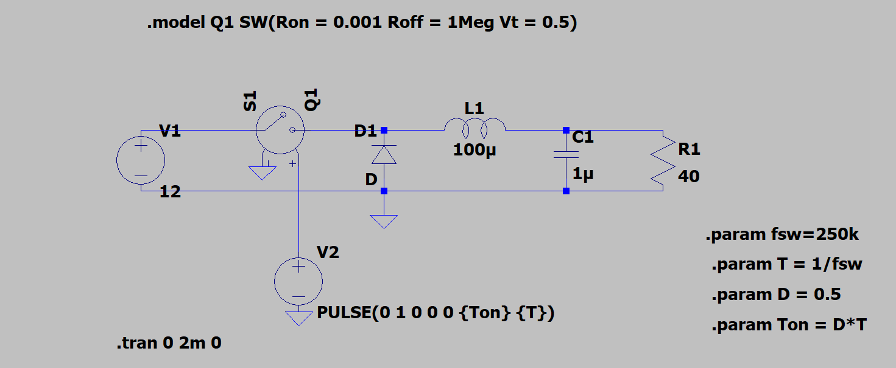
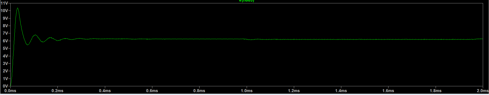

# DC-DC Buck Converter Simulation using LTspice

## Overview
This project demonstrates the design and simulation of a DC-DC Buck Converter in LTspice. The converter steps down a 12V DC input to approximately 6V DC output using PWM switching.

## Circuit Diagram

## Output Waveform

## Specifications

- Input Voltage: 12V
- Output Voltage: ~6V
- Switching Frequency: 250 kHz
- Duty Cycle: 50%
- Inductor: 100 µH
- Capacitor: 1 µF
- Load Resistance: 40 Ω

## Working Principle

A buck converter is a DC-DC converter that reduces the input voltage. The MOSFET acts as a high-speed switch controlled by a PWM signal. The inductor and capacitor smooth the switching waveform to produce a lower DC output voltage.

## Result

The simulated output voltage is approximately 6V, which matches the theoretical value:

Vout = D × Vin

Where:
- D = 0.5
- Vin = 12V

Therefore:

Vout = 0.5 × 12 = 6V

## Software Used

- LTspice XVII

## Author

**Sujal Patil**  
B.Tech Electronics and Communication Engineering
